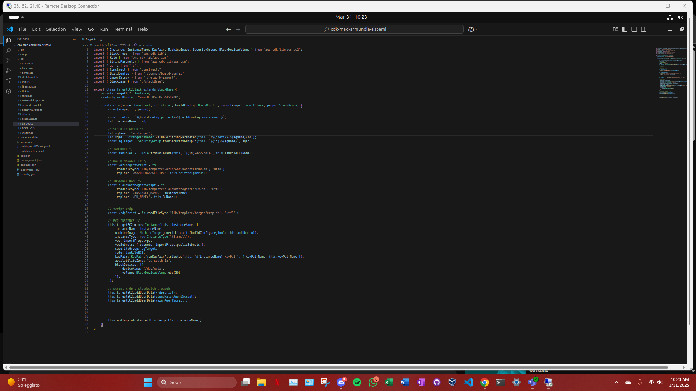

# Deploy istanza target EC2 

abbiamo configurato l'istanza target con EC2 configurata manualmente da cdk e abbiamo fatto il deploy tramite la pipeline di tooling per creare l'istanza nell'account test (ambiente isolato dove abbiamo svolto il progetto).




## File: `targetEC2.ts`

### Funzionalità principali

- Crea un'istanza EC2 Linux (`t3.small`)
- Usa un'immagine Ubuntu specifica
- Applica uno **script Wazuh**, uno script per **CloudWatch** e uno per **XRDP**
- Collega:
  - **Security Group** esistente (preso da SSM)
  - **IAM Role** esistente (per i permessi dell'istanza)
  - **KeyPair** SSH esistente (per accesso remoto)
- Imposta:
  - Zona di disponibilità: `eu-south-1a`
  - Volume EBS da 30 GB

---

##  Struttura del Codice

### Costruttore

```ts
constructor(scope, id, buildConfig, importProps, props)
```

Riceve parametri per configurare il nome dell'istanza, l’ambiente (dev, test, prod), e le risorse importate da altri stack (VPC, subnet).

### Security Group

```ts
const sgTarget = SecurityGroup.fromSecurityGroupId(...)
```

Recupera l’ID del security group da **SSM Parameter Store** e lo collega all’istanza EC2.

### IAM Role

```ts
const iamRoleEC2 = Role.fromRoleName(...)
```

Associa un IAM Role già esistente all’istanza.

### Script di configurazione

Vengono letti e personalizzati tre script:
- `wazuhAgentLinux.sh`: per inviare log al manager Wazuh
- `cloudWatchAgentLinux.sh`: per monitoraggio con CloudWatch
- `xrdp.sh`: per abilitare accesso desktop remoto (XRDP)

```ts
.readFileSync('lib/template/...').replace(...)
```

### Creazione dell’istanza EC2

```ts
this.targetEC2 = new Instance(this, instanceName, { ... })
```

Crea l’istanza con tutti i parametri e le configurazioni definiti sopra.

### Aggiunta UserData

```ts
this.targetEC2.addUserData(...)
```

Aggiunge i tre script come **UserData** per l'esecuzione automatica all'avvio.

### Tag

```ts
this.addTagsToInstance(...)
```

Aggiunge tag all’istanza per riconoscerla facilmente nella console AWS.

---


