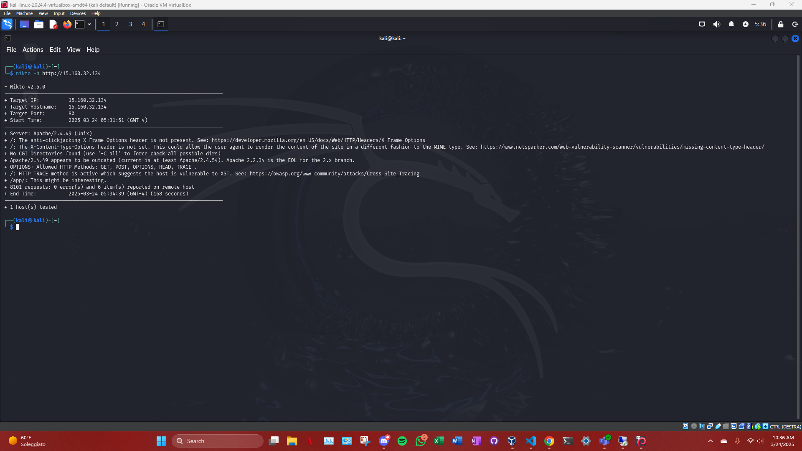
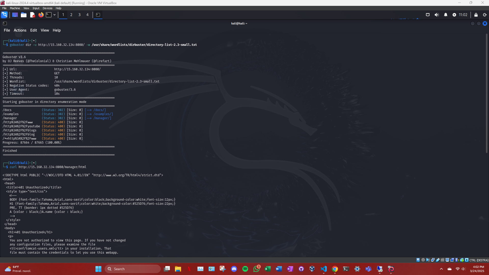
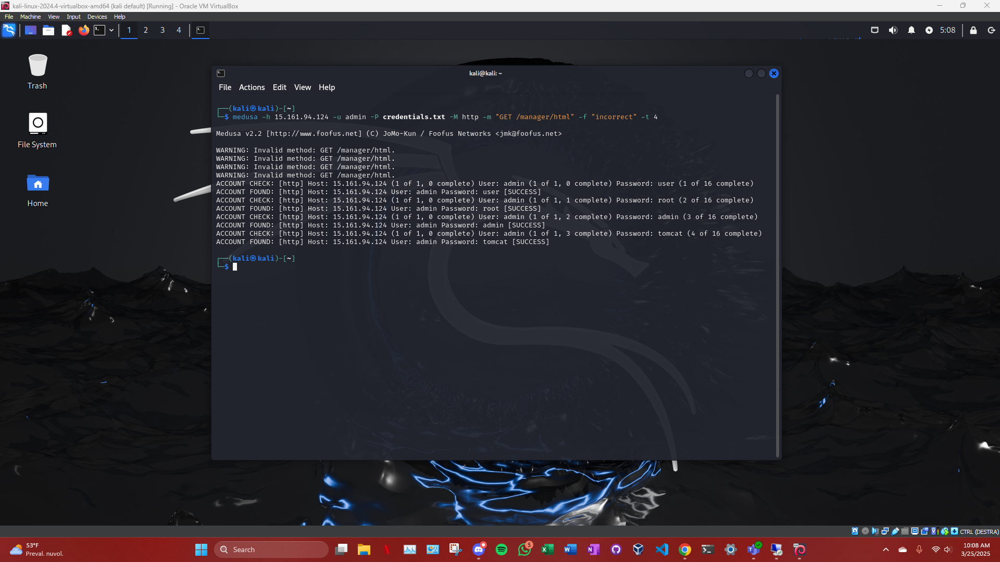

# Tomcat

### 1. **Scansione Nmap su Tomcat** 


#### Comando:
```bash
nmap -p 8080 --script http-enum 15.161.94.124
```

***analisi***:

Abbiamo eseguito una scansione di tipo HTTP Enum per identificare le possibili directory e applicazioni accessibili sulla porta 8080 (Tomcat).

Risultati: Il comando ha identificato le seguenti directory interessanti:

/examples/

/manager/

/docs/

Abbiamo proseguito esplorando /manager/html, che si è rivelato l'accesso al Tomcat Manager.

### 2. ** Scansione con Nikto** 


#### Comando:
```bash
nikto -h http://15.161.94.124:8080/manager/html
```



***analisi***:

Nikto è stato usato per cercare vulnerabilità comuni nel server Tomcat e per identificare eventuali header di sicurezza mancanti o problemi di configurazione.

Risultati: Nikto ha segnalato i seguenti problemi di sicurezza:

Manca l'header X-Frame-Options per prevenire attacchi di clickjacking.

Manca l'header X-Content-Type-Options che potrebbe permettere rendering non previsto dei contenuti.

### 3. **Enumerazione Directory con Gobuster** 


#### Comando:
```bash
gobuster dir -u http://15.161.94.124:8080/manager/html -w /usr/share/wordlists/dirbuster/directory-list-2.3-small.txt
```



***analisi***:

Abbiamo utilizzato Gobuster per enumerare le directory e i file presenti nell'interfaccia di Tomcat Manager per cercare risorse accessibili senza autenticazione.

Risultati: Le directory più rilevanti trovate sono state:

/manager/html/

/manager/html/list

/manager/html/undeploy

Abbiamo cercato di accedere a queste directory con l'autenticazione richiesta, ma ci siamo imbattuti in un errore 401 Unauthorized.


### 4. **Prova di Brute Force per l'Accesso al Manager di Tomcat con Hydra** 


#### Comando:
```bash
hydra -l admin -P credentials.txt http-get-form "http://15.161.94.124:8080/manager/html:username=^USER^&password=^PASS^:F=incorrect"
```


***analisi***:

Abbiamo utilizzato Hydra per tentare un attacco di forza bruta sulle credenziali di accesso al Manager di Tomcat utilizzando un file contenente username e password comuni.

non ho ottenuto risultati


### 5. **Scansione di Credenziali con Medusa** 


#### Comando:
```bash
medusa -h 15.161.94.124 -u admin -P credentials.txt -M http -m "GET /manager/html" -f "incorrect" -t 4
```



***analisi***:

Abbiamo utilizzato Medusa per cercare di forzare l'accesso al Manager di Tomcat con credenziali comuni.

Risultati: Abbiamo trovato le seguenti combinazioni di username e password valide:

Username: admin, Password: user

Username: admin, Password: root

Username: admin, Password: admin

Username: admin, Password: tomcat


