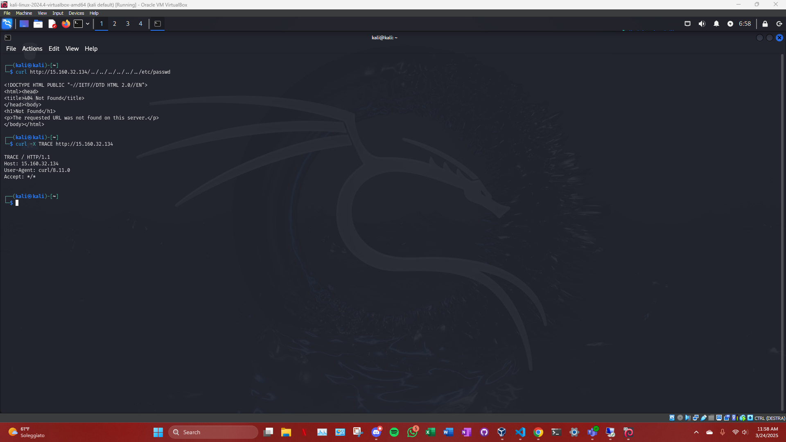
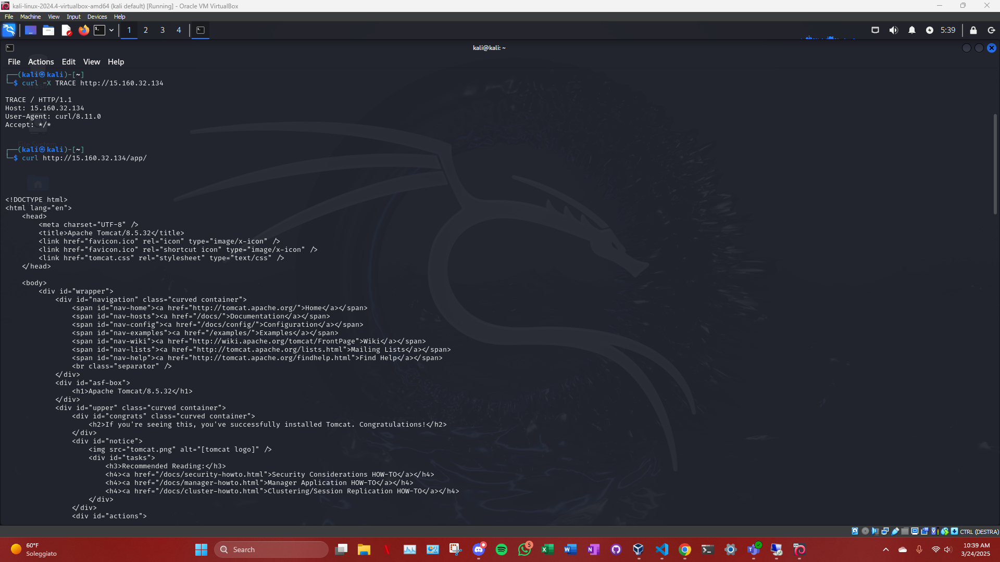
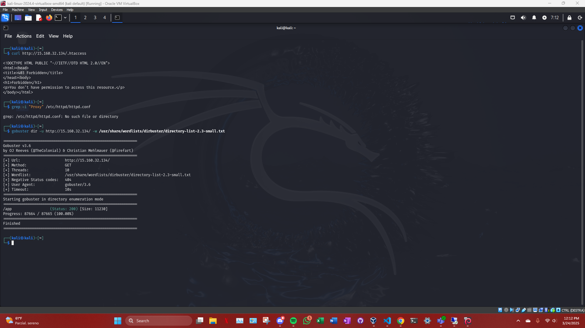

# Apache

### 1. **Scansione con Nmap (TCP Scan)** 

Abbiamo usato Nmap per identificare i porti aperti e le versioni dei servizi in esecuzione sulla macchina target.

#### Comando:
```bash
nmap -sS 15.160.32.134
```

***risultato***: 

```bash
Output: Abbiamo identificato i seguenti porti aperti:

22/tcp (SSH)

80/tcp (HTTP)

554/tcp (RTSP)

3389/tcp (MS-WBT-Server)

7070/tcp (RealServer)

8009/tcp (AJP/1.3)

8080/tcp (HTTP Proxy)
```


***analisi***:

Questa scansione ci ha dato un primo punto di vista sui servizi in esecuzione sulla macchina target. La presenza di Apache HTTP Server (porta 80) e Tomcat (porta 8080) è stata confermata. Inoltre, la porta 8009 è collegata al servizio AJP, che potrebbe essere vulnerabile.

### 2. **Scansione delle Versioni dei Servizi con Nmap** 

#### Comando:
```bash
nmap -sV 15.160.32.134
```
***risultato***: 

```bash
Output:

Apache/2.4.49 (Versione vulnerabile a CVE-2021-41773)

Tomcat 8.5.32 (Versione vulnerabile a CVE-2020-9484)

MySQL 5.7.29 (Versione vulnerabile a diverse vulnerabilità SQL injection)
```

***analisi***:

Abbiamo confermato che Apache 2.4.49 è la versione in esecuzione, che è vulnerabile alla CVE-2021-41773 (Directory Traversal). Abbiamo anche confermato la presenza di Tomcat 8.5.32 e MySQL 5.7.29, che ci permettono di concentrarci su exploit specifici di queste versioni.

### 3. **Scansione delle Vulnerabilità con Nmap** 

Per identificare vulnerabilità note, abbiamo eseguito una scansione utilizzando gli script di vulnerabilità di Nmap.

#### Comando:
```bash
nmap --script=vuln 15.160.32.134
```

***risultato***: 

```bash
CVE-2021-41773: La scansione ha rivelato la vulnerabilità di Directory Traversal in Apache, ma non ha trovato exploit attivi.

HTTP Method Tampering: È stato rilevato che Apache è vulnerabile all'iniezione di metodi HTTP, in particolare il metodo TRACE, che potrebbe essere sfruttato per eseguire attacchi di Cross-Site Tracing (XST).

Directory Discovery: La directory /app è stata identificata come potenzialmente interessante e ospita Tomcat.
```

***analisi***:

Abbiamo trovato due possibili vettori di attacco: uno legato alla vulnerabilità di Apache CVE-2021-41773 (Directory Traversal) e uno legato all'HTTP Method Tampering. Inoltre, la presenza della directory /app ci ha confermato che Apache funge correttamente da proxy verso Tomcat.

### 4. **Tentativo di Directory Traversal** 

Abbiamo testato la vulnerabilità di Directory Traversal in Apache, cercando di accedere a file protetti come /etc/passwd.

#### Comando:
```bash
curl http://15.160.32.134/../../../../../../etc/passwd
```

***risultato***: 

```bash
404 Not Found
```



***analisi***:

Non siamo riusciti a sfruttare la vulnerabilità di Directory Traversal con Apache, poiché il server ha restituito un errore 404 (File Not Found). Questo potrebbe indicare che la configurazione di Apache o la protezione aggiuntiva impedisce l'accesso ai file sensibili.

### 5. **Tentativo di HTTP TRACE** 

Abbiamo testato se il metodo TRACE fosse abilitato su Apache, che potrebbe consentire un attacco di Cross-Site Tracing (XST).

#### Comando:
```bash
curl -X TRACE http://15.160.32.134
```

***risultato***: 

```bash
TRACE / HTTP/1.1
Host: 15.160.32.134
User-Agent: curl/8.11.0
Accept: */*
```



***analisi***:

Il server ha risposto correttamente al comando TRACE, indicando che Apache è configurato per consentire il metodo TRACE. Sebbene questa vulnerabilità non sia stata sfruttata direttamente, conferma che Apache potrebbe essere vulnerabile agli attacchi di XST, che possono essere usati per raccogliere informazioni sensibili.

### 6. **Esplorazione della Directory /app con Gobuster** 

Abbiamo usato Gobuster per eseguire un attacco di enumerazione delle directory sulla macchina target, cercando di scoprire altre risorse nascoste.

#### Comando:
```bash
gobuster dir -u http://15.160.32.134/ -w /usr/share/wordlists/dirbuster/directory-list-2.3-small.txt
```

***risultato***: 

```bash
/app                  (Status: 200) [Size: 11230]

```



***analisi***:

Commento: La directory /app è stata scoperta come un percorso interessante. Essa ospita un'applicazione Tomcat e potrebbe essere utilizzata come punto di accesso per l'attacco. Questo conferma che Apache è configurato correttamente come proxy verso Tomcat.