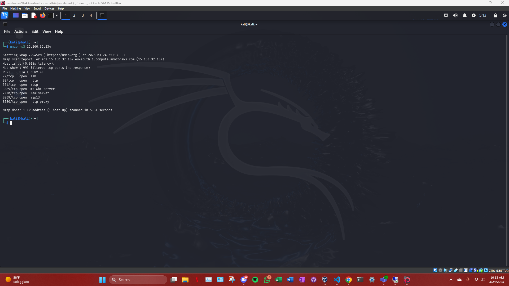

# Nmap e Nikto

### 1. **Scansione con Nmap**

Abbiamo eseguito una scansione iniziale sull'IP della macchina target **15.160.32.134** per identificare le porte aperte e determinare i servizi in esecuzione. I comandi eseguiti sono i seguenti:

#### Comando:
```bash
nmap -sS 15.160.32.134
```

***risultato***: 

```bash
PORT     STATE SERVICE
22/tcp   open  ssh
80/tcp   open  http
554/tcp  open  rtsp
3389/tcp open  ms-wbt-server
7070/tcp open  realserver
8009/tcp open  ajp13
8080/tcp open  http-proxy
```



***analisi***:

Porta 22/tcp (SSH): Il servizio SSH è attivo, permettendo l'accesso remoto alla macchina target.

Porta 80/tcp (HTTP): Apache HTTP Server è attivo sulla porta 80. Questo è il server web in esecuzione sulla macchina.

Porta 8080/tcp (HTTP-Proxy): La porta 8080 è aperta e sembra essere configurata come un proxy HTTP. Potrebbe essere utilizzata per accedere alle applicazioni web ospitate su Tomcat.

Porta 8009/tcp (AJP): La porta 8009 è associata al protocollo AJP (Apache JServ Protocol), che potrebbe essere utilizzata per la comunicazione tra Apache e Tomcat.

### 2. **Identificazione della Versione dei Servizi**
Per raccogliere ulteriori informazioni sui servizi in esecuzione sulla macchina target, abbiamo eseguito un comando nmap con il parametro -sV per rilevare la versione dei servizi attivi.

#### Comando:
```bash
nmap -sV 15.160.32.134
```

***risultato***: 

```bash
PORT     STATE SERVICE     VERSION
22/tcp   open  ssh         OpenSSH 9.6p1 Ubuntu 3ubuntu13.8 (Ubuntu Linux; protocol 2.0)
80/tcp   open  http        Apache httpd 2.4.49 ((Unix))
554/tcp  open  rtsp        ?
3389/tcp open  tcpwrapped
7070/tcp open  realserver  ?
8080/tcp open  http-proxy  ?
```


***analisi***:

Apache 2.4.49 è identificato come la versione di Apache HTTP Server. Questa versione è vulnerabile alla CVE-2021-41773 (Directory Traversal).

OpenSSH 9.6p1: Il servizio SSH è in esecuzione con una versione recente di OpenSSH.

Porta 8080 (HTTP Proxy): Il servizio HTTP Proxy è attivo sulla porta 8080, probabilmente per comunicare con Tomcat.

La porta 554 è associata a un servizio RTSP non identificato.

### 3. **Scansione delle Vulnerabilità con Nmap**
Abbiamo utilizzato un'altra scansione Nmap con il parametro --script=vuln per identificare le vulnerabilità note sui servizi attivi.

#### Comando:
```bash
nmap --script=vuln 15.160.32.134
```

***risultato***: 

```bash
PORT     STATE SERVICE     VERSION
22/tcp   open  ssh         OpenSSH 9.6p1 Ubuntu 3ubuntu13.8 (Ubuntu Linux; protocol 2.0)
80/tcp   open  http        Apache httpd 2.4.49 ((Unix))
|_http-csrf: Couldn't find any CSRF vulnerabilities.
|_http-dombased-xss: Couldn't find any DOM based XSS.
|_http-stored-xss: Couldn't find any stored XSS vulnerabilities.
|_http-trace: TRACE is enabled
| http-enum: 
|_  /app/: Potentially interesting folder
554/tcp  open  rtsp
3389/tcp open  tcpwrapped
|_ssl-ccs-injection: No reply from server (TIMEOUT)
7070/tcp open  realserver
8080/tcp open  http-proxy
| http-method-tamper: 
|   VULNERABLE:
|   Authentication bypass by HTTP verb tampering
|     State: VULNERABLE (Exploitable)
|       This web server contains password protected resources vulnerable to authentication bypass
|       vulnerabilities via HTTP verb tampering. This is often found in web servers that only limit access to the
|        common HTTP methods and in misconfigured .htaccess files.
|              
|     Extra information:
|       
|   URIs suspected to be vulnerable to HTTP verb tampering:
|     /manager/html [GENERIC]
|_      https://www.owasp.org/index.php/Testing_for_HTTP_Methods_and_XST_%28OWASP-CM-008%29
```


***analisi***:

La scansione ha rilevato che la TRACE HTTP method è abilitata. Questo potrebbe essere un punto di vulnerabilità per Cross Site Tracing (XST).

HTTP Verb Tampering: La scansione ha rilevato che il server è vulnerabile a bypass dell'autenticazione tramite HTTP Verb Tampering, una vulnerabilità che potrebbe essere sfruttata per aggirare la protezione delle risorse protette da password come /manager/html.

La scansione ha anche confermato che la directory /app/ è accessibile, il che potrebbe indicare la presenza di un'applicazione web vulnerabile in esecuzione su Tomcat.

### 4. **Test della Vulnerabilità TRACE**

Abbiamo eseguito un attacco di HTTP TRACE per vedere se il server restituiva informazioni sensibili durante il tracing delle richieste HTTP.

#### Comando:
```bash
nmap --script=vuln 15.160.32.134
```

***risultato***: 

```bash
TRACE / HTTP/1.1
Host: 15.160.32.134
User-Agent: curl/8.11.0
Accept: */*
```

***analisi***:

Il comando TRACE non ha restituito informazioni sensibili, indicando che la vulnerabilità di Cross Site Tracing (XST) non ha avuto successo in questo caso.

### 5. **Esplorazione della directory /app**

Abbiamo esplorato la directory /app/ sulla macchina target per cercare applicazioni vulnerabili o configurazioni errate.

#### Comando:
```bash
curl http://15.160.32.134/app/
```

***risultato***: 

```bash
La risposta ha restituito una pagina di default di Apache Tomcat, che conferma che Tomcat è stato correttamente installato e configurato sulla macchina. Non sono state rilevate vulnerabilità evidenti nella directory /app/ al momento dell'esplorazione.
```