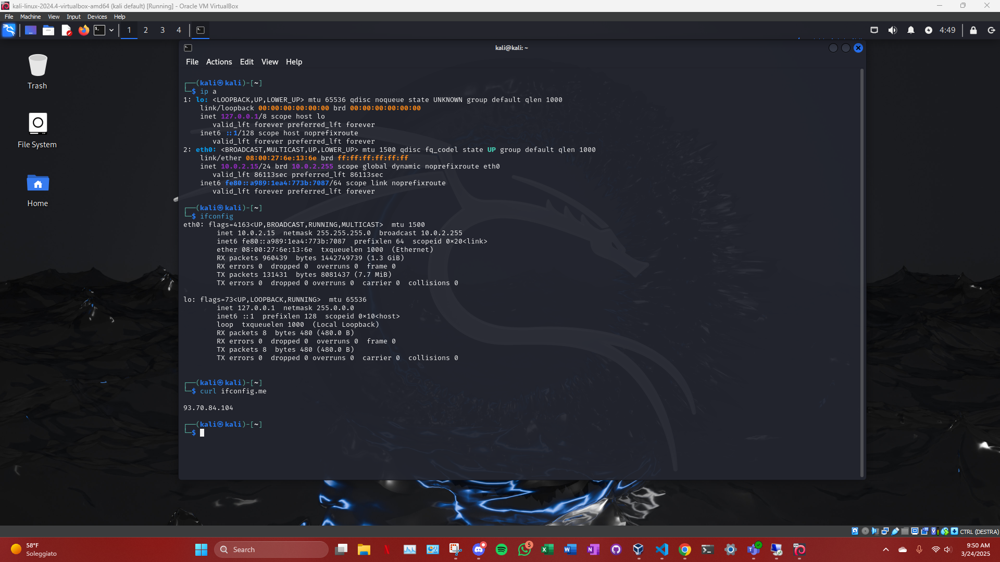
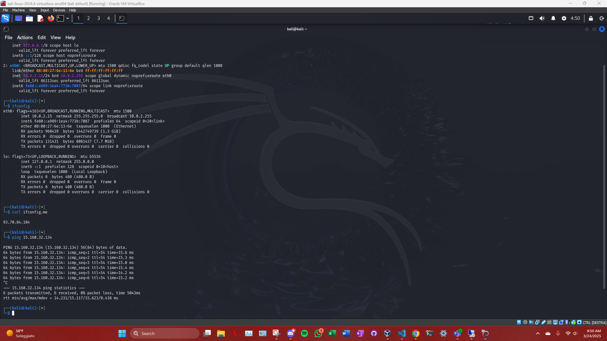

# Pre-requisiti 

## ***Architettura di AWS e Istanze EC2***
AWS (Amazon Web Services) è una piattaforma di cloud computing che fornisce una vasta gamma di servizi, tra cui il calcolo, l'archiviazione, i database e la rete. Nella nostra configurazione, l'istanza target è ospitata su AWS come una istanza EC2 (Elastic Compute Cloud). EC2 è un servizio che consente di creare e gestire macchine virtuali, che possono essere configurate con diversi sistemi operativi, tra cui Ubuntu (usato nel nostro caso). Ogni istanza EC2 è associata a un security group, che funge da firewall virtuale per controllare il traffico in entrata e in uscita.

I security group sono configurazioni che specificano quali porte e protocolli sono permessi o negati per una determinata istanza. Per il penetration testing, è stato importante assicurarsi che l'istanza target fosse accessibile dal nostro offenser (la macchina che esegue il penetration testing), ma limitando l'accesso da altri indirizzi IP non autorizzati. Nello specifico, abbiamo configurato i security group in modo che l'istanza target fosse raggiungibile solo dal nostro indirizzo IP e dalla macchina Kali Linux (offenser) nella stessa rete privata.

## ***Offenser: Kali Linux su VirtualBox***
L'offenser è una macchina virtuale che esegue Kali Linux, un sistema operativo basato su Debian progettato per il penetration testing e l'analisi della sicurezza. Kali Linux fornisce una vasta gamma di strumenti e utilità per effettuare attacchi informatici controllati e testare la sicurezza dei sistemi. La macchina è stata eseguita in un ambiente di virtualizzazione, utilizzando VirtualBox, un software che permette di creare e gestire macchine virtuali.

Processo di Connessione tra Offenser e Istanze Target
Il processo di connessione tra l'offenser e l'istanza target è stato fondamentale per la fase di pen testing. Di seguito sono descritti i principali passaggi:

## ***Verifica della Connessione di Rete***

Prima di tutto, è stato necessario assicurarsi che la macchina Kali (offenser) potesse connettersi correttamente all'istanza EC2 target. Ciò è stato fatto verificando la connessione di rete tra le due macchine, utilizzando comandi come ping per controllare se l'istanza target rispondeva.

Inoltre, è stato eseguito il comando ip a su Kali per identificare l'indirizzo IP locale e confermare che fosse correttamente configurato per comunicare con la rete.

