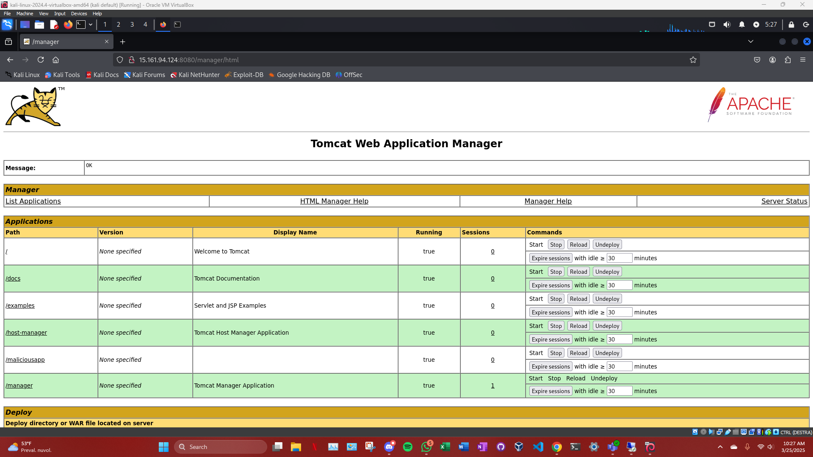
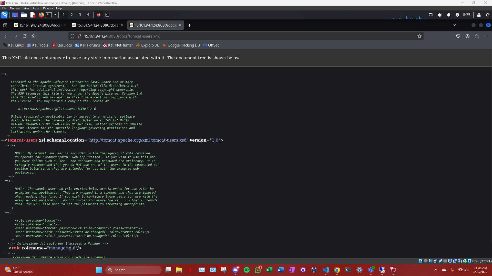
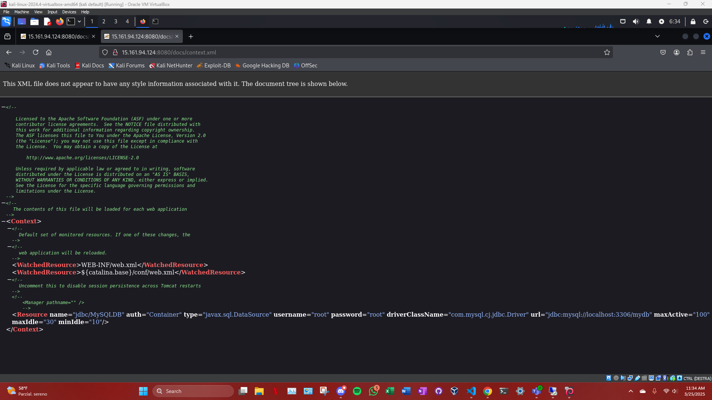
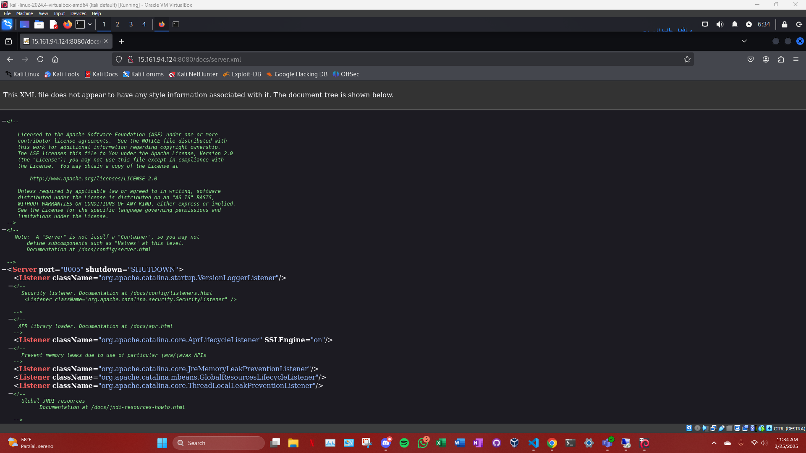

# Esplorazione del manager di tomcat 

dopo aver trovato le credenziali del manager di tomcat ho esplorato i file e ho trovato 

#### Esplorazione del File tomcat-users.xml
Comando eseguito:
Abbiamo visitato la pagina http://15.161.94.124:8080/docs/tomcat-users.xml, dove abbiamo trovato le credenziali dell'utente di amministrazione di Tomcat.

Risultati: Le credenziali di accesso sono:

Username: admin

Password: admin

Queste credenziali ci hanno permesso di accedere al Tomcat Manager.

#### Esplorazione del File context.xml
Comando eseguito:
Abbiamo visitato la pagina http://15.161.94.124:8080/docs/context.xml, trovando le configurazioni di accesso al database MySQL.

Risultati: Le credenziali del database MySQL sono:

Username: root

Password: root

URL Database: jdbc:mysql://localhost:3306/mydb

#### Esplorazione del File server.xml
Comando eseguito: 
Abbiamo visitato la pagina http://15.161.94.124:8080/docs/server.xml, che conteneva le configurazioni del server, inclusi i connettori e i listener.

Risultati: Non sono state trovate informazioni immediatamente utili per l'escalation dei privilegi, ma il file contiene configurazioni dei connettori, inclusi quelli HTTP e AJP sulla porta 8080 e 8009.

#### Esplorazione delle Directory di Documentazione e API
Comando eseguito: 
Abbiamo eseguito diverse scansioni con Gobuster per esplorare directory come /docs/, /examples/, e /api/.

Risultati: Non sono state trovate informazioni sensibili nei file di documentazione, ma la directory /docs/ ha mostrato diversi file di esempio che potrebbero contenere informazioni utili per l'analisi, come la documentazione di Tomcat.

