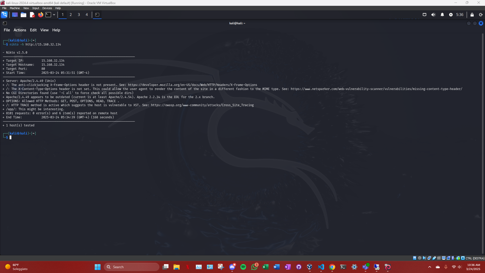

# Cosa mi porta a fare exploit su Tomcat ? 

### 1. Indizi da nmap
La scansione con nmap ci ha rivelato delle informazioni preziose:

La porta 8080 (tipica di Tomcat) è aperta. Questo è un indicatore diretto che Tomcat è in esecuzione e ascolta su quella porta. Nmap ci ha anche rivelato che la versione di Tomcat in esecuzione è 8.5.32.

Quindi, da nmap, sappiamo che Tomcat è in esecuzione e, dato che Tomcat 8.5.32 è una versione nota, possiamo cercare vulnerabilità specifiche legate a quella versione.

Inoltre, nmap ha anche rilevato che il servizio Tomcat Manager è presente ma protetto da autenticazione (status 401 Unauthorized), il che ci suggerisce che:

L'accesso al Manager di Tomcat potrebbe essere possibile, ma richiede credenziali.

La vulnerabilità di autenticazione debole o configurazioni errate di Tomcat potrebbe consentirci di bypassare l'autenticazione.

### 2. Indizi da Nikto
Nikto ci ha fornito altre informazioni cruciali:

Nikto ha eseguito un test completo sulla pagina principale e ha trovato alcune vulnerabilità potenziali. Una di queste è la vulnerabilità di HTTP Verb Tampering. Questa vulnerabilità ci consente di manipolare il tipo di richiesta HTTP inviata a Apache (ad esempio, passando da GET a POST, PUT, ecc.), il che potrebbe darci il controllo di accesso a risorse che sono normalmente protette.

Inoltre, Nikto ha identificato anche la presenza della cartella /app, che ci ha confermato che Tomcat è correttamente installato. Sebbene la cartella di Tomcat non sia direttamente vulnerabile, l'indicazione che Tomcat è attivo e funzionante ha indirizzato il nostro interesse verso le configurazioni di Tomcat.

In generale, Nikto ha confermato che Apache è correttamente configurato per fare da proxy verso Tomcat, ma non ha trovato vulnerabilità evidenti in Apache che potessero permettere un attacco diretto. Questo ci ha quindi indirizzato a concentrarci su Tomcat.

### 3. Test su Apache e la Configurazione del Proxy
Durante i test su Apache, abbiamo confermato che Apache funge da reverse proxy per Tomcat. Questo significa che Apache sta ricevendo le richieste HTTP e le inoltra a Tomcat. Sebbene Apache stesso non abbia mostrato vulnerabilità evidenti, il fatto che Apache stia esponendo Tomcat tramite il proxy ci dà una finestra per interagire con Tomcat. Se Apache non avesse agito come proxy o se fosse stato completamente sicuro, non avremmo avuto alcun punto di accesso alla macchina Tomcat attraverso la rete.

In altre parole, l'accesso alla porta 8080 di Tomcat è stato facilitato proprio grazie al proxy di Apache. La configurazione di Apache, purtroppo, non è sufficiente a proteggere Tomcat da un attacco che possa sfruttare la configurazione errata di Tomcat.